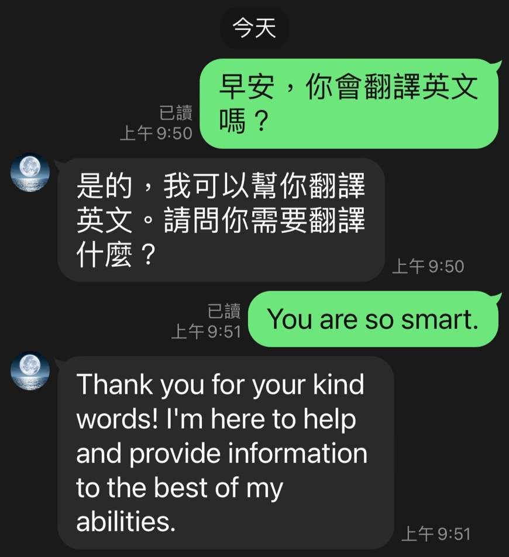

# Line_Bot 串接 OpenAI

## Line 聊天介面



## 功能

1. 可以通過 Line 與 ChatGPT 以文字對話，但使用上有流量限制
2. 此專案使用 gpt-3.5-turbo model，相關的流量限制說明請參考下列資料
3. 流量限制參考資料 :

      https://platform.openai.com/docs/guides/rate-limits/rate-limits?context=tier-free   
      https://openai.com/pricing

## 使用方式

1. 申請 Line Developer 帳號
2. 新增 Messaging API channel 並取得 Channel ID 、 Channel secret 及 Channel access token
3. clone 本專案 至 本地

   ```bash
   git clone ...
   ```
4. 在本地開啟之後，透過終端機進入資料夾，輸入：

   ```bash
   npm install
   ```

5. 依照 .env.example 設定相關變數
6. 部署專案後開啟 Line 搜尋 Channel ID 加入好友即可開始聊天


## 實作紀錄
[實作紀錄](https://medium.com/@claire210401/%E4%BB%A5-node-js-%E4%B8%B2%E6%8E%A5-open-ai-%E5%BB%BA%E7%AB%8B-line-%E8%81%8A%E5%A4%A9%E6%A9%9F%E5%99%A8%E4%BA%BA-%E4%BB%A5-gpt-3-5-turbo-model-%E7%82%BA%E4%BE%8B-586b73624632)

## 參考資料

### Line-bot-sdk
https://github.com/line/line-bot-sdk-nodejs/blob/master/examples/echo-bot/index.js

### OpenAI
https://platform.openai.com/docs/quickstart?context=node
https://platform.openai.com/docs/guides/text-generation/chat-completions-api


